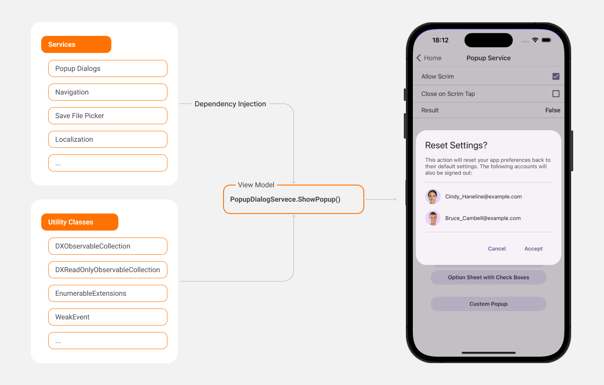

<!-- default badges list -->

<!-- default badges end -->

# DevExpress MVVM for .NET MAUI

[DevExpress Mobile UI](https://www.devexpress.com/maui/) allows you to use the .NET cross-platform UI toolkit and C# to build native apps for iOS and Android.

